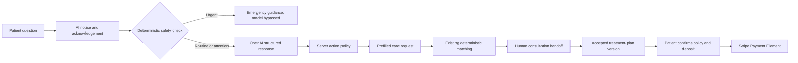

# AI Care Guide to Booking

## Outcome

The patient Care app implements one governed journey from an open-ended question to a patient-controlled booking:



The AI is a guide, not a clinician, ranking engine, scheduler, or payment actor. It cannot call booking, appointment, case, matching, or payment tools. It returns a typed suggestion; the API validates that suggestion against current server-side journey state, and the patient performs any mutation in a separate UI.

## Implemented surface

- Care `/assistant`: notice acknowledgement, conversational intake, emergency presentation, human handoff, and controlled CTAs.
- `POST /api/v1/assistant/messages`: patient-only encrypted sessions, idempotent exchanges, deterministic safety routing, OpenAI Responses API, strict structured output, and action normalization.
- Care `/start`: accepts AI-collected procedure, location, timing, and priority as editable prefills. Timing and priority are now persisted on the case.
- Care `/booking`: lists only backend-calculated checkout options for accepted plan versions. The patient reviews the total, deposit, and cancellation-policy snapshot before creating the booking/payment intent.
- Stripe Payment Element receives the provider client secret. Card data is never sent to or stored by Dental Trust.
- Privacy export materializes encrypted assistant messages for the subject; bounded account deletion removes assistant sessions unless a legal hold requires retention.

## Safety and trust controls

1. A local deterministic classifier runs before the model. Trouble breathing, uncontrolled bleeding, rapidly spreading face/neck swelling, unconsciousness, and severe facial trauma bypass OpenAI and return emergency guidance.
2. The model cannot diagnose, prescribe, guarantee an outcome, invent a price, or claim an action succeeded. Its output is validated against a strict JSON schema.
3. Model-requested actions are intersected with server-permitted actions. `OPEN_BOOKING` is impossible without a current checkout option; `START_REQUEST` is impossible once a case exists.
4. `store: false` is sent to the OpenAI Responses API. A one-way user hash is sent as `safety_identifier`; internal user IDs and provider credentials are not sent.
5. Conversation content is AES-256-GCM encrypted with per-message associated data. Audit records contain safety/action metadata, not prompts or responses.
6. Impersonated sessions and non-patient roles cannot use the assistant. Existing case, booking, messaging, matching, and payment authorization remains authoritative.
7. Human consultation is an explicit handoff to secure messaging. The AI does not create an appointment because patient appointment creation is not authorized by the scheduling policy.

## Model and configuration

The default is `gpt-5.6` through the OpenAI Responses API, with low reasoning effort, low verbosity, a 900-token output ceiling, strict structured output, a 15-second timeout, and response storage disabled.

Required production variables:

```dotenv
OPENAI_API_KEY=
OPENAI_BASE_URL=https://api.openai.com/v1
OPENAI_MODEL=gpt-5.6-luna
OPENAI_TIMEOUT_MS=15000
NEXT_PUBLIC_STRIPE_PUBLISHABLE_KEY=
```

Production configuration fails closed without an OpenAI key or when the endpoint is not HTTPS. A missing key outside production leaves the rest of Care operational and returns `503` only for model-backed messages. Emergency routing remains local and does not depend on OpenAI.

## Rollout plan

This is a single end-to-end implementation with progressive exposure, not separate throwaway implementations.

### Gate 1 — internal and seeded data

- Apply migration `202607140011_ai_care_assistant` and verify rollback/restore procedures.
- Run automated quality gates and a no-network emergency test.
- Build a bilingual evaluation set covering normal intake, ambiguous symptoms, urgent symptoms, prompt injection, attempts to force booking/payment, and unsupported price/outcome questions.
- Verify zero plaintext prompts in logs, audit rows, error tracking, and traces.

Exit criteria: 100% urgent-set recall in the deterministic layer; 0 unauthorized action executions; 100% structured-output validation in the release evaluation set.

### Gate 2 — staff pilot

- Enable for Dental Trust staff and test patients only.
- Review anonymized outcome metadata and separately consented conversation samples; do not make raw conversation review a default analytics workflow.
- Validate human handoff response time and booking reconciliation with Stripe test mode.

Exit criteria: at least 95% helpful-or-neutral review score, less than 2% provider/validation failures, no high-severity safety or privacy finding, and successful booking reconciliation.

### Gate 3 — limited patient cohort

- Release to a small locale/country cohort with an immediate kill switch at the deployment/configuration layer.
- Keep human-support CTA visible on all turns and monitor emergency routing, abandonment, handoff load, and checkout conversion.
- Expand only after clinical safety, privacy, operations, and product owners sign off on the same build.

### Gate 4 — general availability

- Add a scheduled retention/purge policy approved by privacy counsel before production patient data is onboarded.
- Establish monthly safety regression evaluations and prompt/model-change approval.
- Treat model, prompt version, schema, classifier patterns, and action-policy changes as release-controlled changes with replayable evaluation evidence.

## Measurement

Primary funnel:

- AI notice accepted → first message sent.
- First message → structured care request started.
- Request started → request created.
- Case → human consultation handoff.
- Accepted plan → booking checkout opened.
- Checkout opened → deposit succeeded.

Guardrails:

- urgent classifier recall and false-positive rate;
- suggested actions normalized or rejected by the server;
- model/provider failure and latency percentiles;
- patient requests for human support;
- booking/payment reconciliation failures;
- privacy export/deletion completeness;
- prompt or response leakage in operational telemetry (target: zero).

Metrics must use event/action metadata and aggregate funnel state. Prompts, health narratives, and assistant replies must not become general analytics dimensions.

## Remaining release requirements

- No clinical validation panel or production evaluation corpus is included in the repository.
- Conversation TTL/purge automation still requires an approved retention period.
- Consultation handoff currently opens secure messaging; it does not create a dedicated concierge task or patient-created appointment.
- The emergency pattern set is a fail-safe layer, not a medical device or comprehensive triage protocol.
- Production needs approved OpenAI and Stripe accounts, data-processing terms, incident procedures, cost/rate-limit alarms, and jurisdiction-specific privacy/clinical review.

These are launch gates. They do not weaken the implemented fail-closed behavior.
