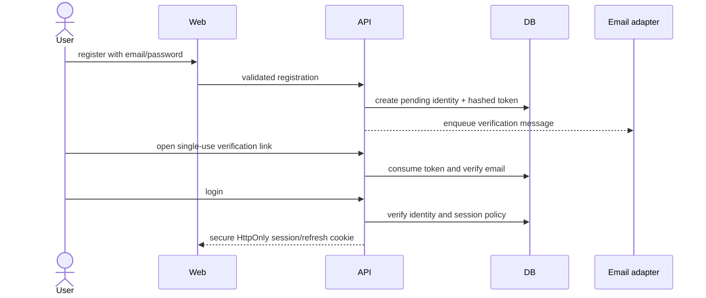
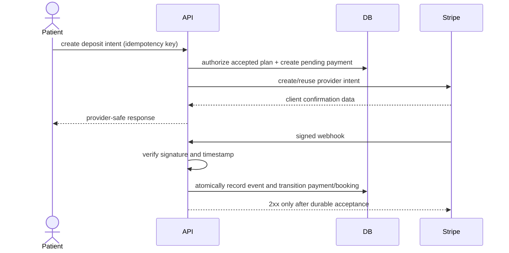
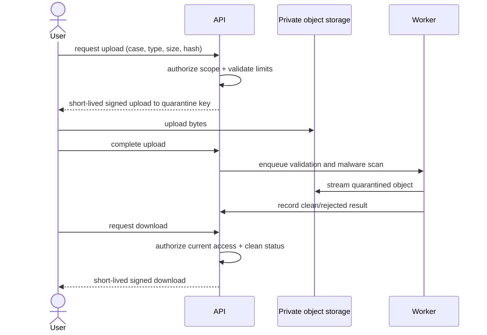

# API

The NestJS API is served under `/api/v1`. OpenAPI is exposed at `/api/docs` outside production. The generated document is the endpoint-level source of truth for implemented controllers; shared Zod contracts protect the client/server boundary.

## Implemented surface

The current production controller surface is deliberately narrow:

- `POST /auth/register`, `POST /auth/login`, `GET /auth/me`, `POST /auth/logout`
- `GET /auth/sessions`, `DELETE /auth/sessions/:sessionId`
- `POST /auth/email-verification/request`, `POST /auth/email-verification/consume`
- `POST /auth/password-reset/request`, `POST /auth/password-reset/consume`
- `POST /auth/mfa/totp/enroll`, `POST /auth/mfa/totp/confirm`, `POST /auth/mfa/verify`
- `GET /public/clinics`, `GET /public/clinics/:slug`, `GET /public/dentists`, `GET /public/dentists/:slug`, `POST /contact`
- `POST /cases`, `GET /cases`, `GET /cases/:caseId`, `POST /cases/:caseId/transitions`
- `POST /assistant/messages` (patient-only AI guidance; encrypted, structured, and server action-gated)
- `POST /files/uploads`, `POST /files/:fileAssetId/finalize`, `GET /files/:fileAssetId/status`, `GET /files/:fileAssetId/download`
- `POST /files/clinic-uploads`, `POST /files/clinic-uploads/:fileAssetId/finalize`, `GET /files/clinic-uploads/:fileAssetId/status`, `GET /files/clinic-uploads/:fileAssetId/download`
- `POST /payments/deposit-intents`, `GET /payments`, `POST /payments/:paymentId/refunds`
- `POST /payments/webhooks/stripe` (signed provider callback; no user session)
- `GET /cases/:caseId/appointments`, `GET /cases/:caseId/appointments/availability`, `POST /cases/:caseId/appointments`
- `POST /cases/:caseId/appointments/:appointmentId/reschedule`, `POST /cases/:caseId/appointments/:appointmentId/cancel`, `POST /cases/:caseId/appointments/:appointmentId/attendance`
- `GET /cases/:caseId/threads`, `POST /cases/:caseId/threads`
- `GET /cases/:caseId/threads/:threadId/messages`, `POST /cases/:caseId/threads/:threadId/messages`, `POST /cases/:caseId/threads/:threadId/messages/read`
- `GET /cases/:caseId/threads/:threadId/internal-notes`, `POST /cases/:caseId/threads/:threadId/internal-notes` (assigned staff only)
- `GET /cases/:caseId/journey`, `POST /cases/:caseId/journey/milestones/:milestoneId/complete`, `POST /cases/:caseId/journey/instructions`
- `POST /cases/:caseId/journey/changes`, `POST /cases/:caseId/journey/changes/:changeId/acknowledge`
- `GET /cases/:caseId/passport`, `POST /cases/:caseId/passport/drafts`, `POST /cases/:caseId/passport/versions/:versionId/publish`
- `GET /cases/:caseId/passport/versions/:versionId/download`, `POST /cases/:caseId/passport/versions/:versionId/shares`, `DELETE /cases/:caseId/passport/shares/:shareId`
- `GET /passport-shares/:opaqueToken` (public, expiry/revocation/access-limit checked, then redirected to a short-lived private download)
- `POST /trust/incidents`, `GET /trust/incidents`, `GET /trust/incidents/:incidentId`
- `POST /trust/cases/:caseId/warranty-claims`, `POST /trust/incidents/:incidentId/updates`
- `POST /trust/incidents/:incidentId/triage`, `POST /trust/incidents/:incidentId/close`, `POST /trust/incidents/:incidentId/reopen`
- `POST /trust/reviews`, `GET /trust/reviews`, `POST /trust/reviews/:reviewId/responses`, `POST /trust/reviews/:reviewId/reports`, `POST /trust/reviews/:reviewId/moderation`
- `GET /trust/review-reports`, `POST /trust/review-reports/:reportId/decision`
- `POST /trust/privacy/requests`, `GET /trust/privacy/requests`, `GET /trust/privacy/requests/:privacyRequestId`, `POST /trust/privacy/requests/:privacyRequestId/transitions`
- `POST /trust/privacy/requests/:privacyRequestId/execution/retry`, `GET /trust/privacy/requests/:privacyRequestId/export/download`
- `GET /trust/privacy/legal-holds`, `POST /trust/privacy/legal-holds`, `POST /trust/privacy/legal-holds/:legalHoldId/release`
- `POST /trust/support/elevations`, `GET /trust/support/elevations`, `POST /trust/support/elevations/:elevationId/revoke`
- `POST /clinic-operations/organizations`, `GET /clinic-operations/overview`, `GET /clinic-operations/onboarding`
- Clinic onboarding mutations under `/clinic-operations/onboarding/*` for profile, locations, declarations, scanned evidence, terms, Stripe Connect payout onboarding, and verification submission
- Clinic dentist, team/invitation/activity, assigned-case opportunity, recurring availability/block/policy/calendar, versioned service/pricing, analytics, and billing reads and mutations under `/clinic-operations/*`
- `GET /health/live`, `GET /health/ready`

The implemented trust/safety slice records and processes incidents, warranty claims, verified reviews, privacy requests, scoped legal holds, export artifacts, bounded deidentification, and support elevation. It does not deliver incident notifications, propagate deletion tombstones into backups/providers, or replace jurisdiction-specific operating procedures. See [Known limitations](KNOWN_LIMITATIONS.md) and [Trust and safety](TRUST_SAFETY.md).

## Scheduling and secure case messaging

Appointment contracts accept only explicit RFC 3339 UTC instants ending in `Z` plus a validated IANA display timezone. Creation requires an active selected clinic assignment and an actively affiliated dentist. Patients, caregivers with `VIEW_APPOINTMENTS`, and assigned selected organizations can read appointments; only the patient owner or assigned clinic staff can reschedule/cancel, and only assigned clinic staff can create an appointment or record attendance. Every mutation requires `X-Idempotency-Key` and an optimistic appointment version where applicable.

Clinical visits require an active location in the selected clinic. Availability checks enforce the clinic's notice and advance windows, active recurring rules for consultation or treatment, location/dentist time-off blocks, rule capacity, and patient/dentist appointment conflicts. PostgreSQL constraints and triggers repeat the critical tenant, affiliation, active-location, governed-window, capacity, and overlap checks inside the write transaction so concurrent requests cannot bypass the application check. An active calendar connection currently records provider synchronization health; provider busy windows are not imported into Dental Trust availability and therefore are not represented as available-time evidence.

The meeting adapter is `development` outside production or `manual` with an explicit bare-hostname HTTPS allowlist. Only consultations provision a meeting link; clinical visits reject one. Production refuses the development adapter, an empty or malformed allowlist, a missing consultation link, HTTP URLs, credentials/fragments, and non-allowlisted hosts. Join URLs and cancellation reasons are encrypted at rest and omitted from audit/outbox/idempotency payloads.

Message threads are case-scoped. Access is limited to the patient owner, a current caregiver grant with `PARTICIPATE_IN_MESSAGES`, or the actively assigned selected organization. Thread subjects and message bodies are context-bound encrypted fields. Attachments must already be case documents with both `AVAILABLE` and `CLEAN` status. Read receipts are per message/user. Staff internal notes use a separate organization-scoped table, policy, controller path, and response shape; participant endpoints and other assigned organizations never join or return them. Message text, subjects, and internal-note text are never included in logs, audit metadata, outbox events, or stored idempotency responses.

The current appointment, thread, message, and internal-note reads return at most 100 records. They do not yet expose a continuation cursor, so accessing older collaboration history remains a documented release gap rather than silently triggering an unbounded read.

## Clinic operations API

Clinic organization creation requires a verified, current-MFA user without an existing selected tenant. Every subsequent clinic operation resolves an active selected organization membership and clinic-staff record. Named clinic permissions govern onboarding, team, case inbox, scheduling, services, analytics, and billing; role names alone do not authorize a write. High-value mutations require `X-Idempotency-Key`, use optimistic versions where records are editable, and write audit/outbox evidence without copying protected contact, payout, invitation, or availability-reason plaintext.

Onboarding remains incomplete until the clinic has legal/contact/clinical-leader/aftercare data, an active location, required declarations, clean scanned evidence, accepted terms, an active payout account, and the required clinic and dentist verification cases. Submission is an attestation-driven request for independent verification; it never self-approves evidence or fabricates a verified badge. Clinic evidence uses the same private quarantine, malware scan, detected-MIME, and short-lived signed-download controls as patient files, with clinic-tenant authorization.

Clinic team invitations are email-bound, seven-day, opaque, single-use credentials. Email and recoverable token material are encrypted; token lookup uses a hash. Acceptance requires the matching authenticated email, current MFA, no impersonation, and atomically creates or activates the scoped membership and clinic staff record. Creation and acceptance are implemented, but outbound invitation delivery is not yet processed by the worker.

Service publication creates a new immutable price version with integer minor-unit bounds, ISO currency, included/excluded services, material/brand options, effective time, warranty snapshot, and author. Archiving a service does not rewrite historical price evidence.

Analytics are bounded server-side aggregates. `newCases` covers 30 days; average response time covers assigned-to-responded opportunities over 90 days. Plan completion, cost variance, schedule variance, incidents, warranty claims, bookings, and aftercare SLA use 365-day windows. Cost variance is the average absolute governed `TOTAL_PRICE_MINOR` change divided by its non-zero prior value; schedule variance is the average absolute difference between scheduled and completed milestone times; aftercare SLA is the share of escalations resolved by their due time. Consultation conversion is completed consultations divided by consultations, while booking/treatment completion is completed bookings divided by bookings. Missing denominators return `null`, not a fabricated zero.

## Treatment journey and Dental Passport

Journey reads are limited to the patient owner or the actively assigned selected clinic; broad platform case-read roles, caregivers, impersonation, stale memberships, and unselected tenants do not grant this clinical view. Clinic mutations require current MFA and an allowed selected-clinic role. Medication, discharge, follow-up, and passport clinical text is provider-supplied and context-bound encrypted; the service never derives a diagnosis, prescription, or clinical instruction.

Milestone completion uses optimistic versions. Treatment/price changes store immutable structured before/after values, reason, kind, author, and creation time. Patient acknowledgement is a separate append-only record attributable to the owning patient and current session. Every journey/passport/share mutation requires `X-Idempotency-Key` and writes audit plus outbox evidence without copying clinical text into either payload.

A passport draft requires a completed-treatment case, an active selected-clinic assignment, and an actively affiliated treating dentist. Required treatment summary, discharge guidance, follow-up guidance, materials, provenance, and treatment-completion date are covered by deterministic canonical SHA-256 content metadata. Published versions retain the previous version checksum, become immutable, supersede the prior published version, and reference a generated bilingual PDF in private object storage. Downloads require a fresh owner/assigned-clinic authorization and return only a five-minute signed object URL.

Patient-created share credentials are opaque HMAC-derived values suitable for a QR payload; they contain no case ID, patient data, or clinical data. Only the SHA-256 token hash is persisted. A share is expiry-bound, optionally access-count-bound, revocable, and restricted to the exact published passport file. Each known-token attempt appends a grant/denial access record with only secret-keyed IP/user-agent hashes. All denial states use the same not-found response. The public endpoint redirects an allowed request to a short-lived private-object URL.

## Trust and safety API

All trust mutations require `X-Idempotency-Key`. Patient incident narratives, review-report details, and privacy-request text are encrypted before persistence. Incident list/detail responses select only `PARTICIPANTS` timeline events; staff-internal notes are not returned by these endpoints.

Incident severity owns a server-calculated response target: critical one hour, high four hours, medium 24 hours, and low 72 hours. A patient can reopen a resolved/closed incident they own. Closing and triage require an assigned incident-management capability and current MFA. Warranty terms and clinic identity come from the completed platform booking rather than browser input.

A review is marked verified only after the service and database both confirm the author owns the case and that a completed platform booking exists for the reviewed clinic. Clinic responses require an active clinic-staff record in the reviewed clinic tenant. Review and response publication is moderation-gated; abuse-report details never enter audit or outbox payloads.

Privacy-request queue processing requires `privacy:manage`, current MFA, no impersonation, an explicit state transition, optimistic version, and a patient-visible message. Approval requires structured identity-verification evidence and creates an execution command. The worker uses leases and idempotent evidence, streams checksum-verified ZIP exports into private object storage, requires a delivered pre-deletion notice, blocks unsafe deletion, records legal-hold retention, revokes credentials/shares, and deidentifies direct account/profile identifiers. Owner-authorized export download URLs are short lived; expired artifacts are purged hourly. `COMPLETED` records and successful execution evidence are immutable.

Support elevation is created by a current-MFA platform/super administrator for an active support agent and subject. A grant has a ticket reference, reason, five-to-120-minute expiry, approver, and one or more of `CASE_READ`, `INCIDENT_READ`, `INCIDENT_UPDATE`, and `PRIVACY_STATUS_READ`. The support agent activates it with `X-Support-Elevation-Id`; the authentication guard revalidates expiry, actor, subject, capability, and route on every request and audits every use. `GET /auth/me` returns a visible `impersonation` object while active.

## Conventions

- JSON request and response bodies use UTF-8 and stable `camelCase` fields.
- Timestamps are RFC 3339 UTC strings; dates without time use ISO `YYYY-MM-DD`.
- Money uses `{ amountMinor, currency }`, never floating-point major units.
- List endpoints use bounded cursor pagination and explicit filters/sort. Full-table responses are prohibited.
- Mutations that may be retried accept `Idempotency-Key`; provider webhooks use the provider event ID.
- `X-Request-Id` is accepted when syntactically safe or generated by the API and returned on every response.
- Breaking transport changes require a new API version; adding optional fields is non-breaking.

## Required authentication flow



Passwords are Argon2id hashes and implemented session tokens are random, expiry-bound, and stored as hashes. The browser does not persist bearer tokens in local storage. Email-verification and password-reset requests use enumeration-safe acknowledgements, hashed single-use expiring tokens, encrypted outbox credentials, atomic consumption, audit records, and session revocation after reset. The worker renders localized minimal-disclosure messages, decrypts a lifecycle token only at delivery, suppresses expired actions, and sends through configured SMTP with bounded queue retry. Production still requires an approved sending domain, provider credentials, bounce/suppression operations, and provider-backed acceptance testing. Clinic team invitation creation/acceptance is implemented, but its outbound delivery processor is not; secure-share tokens are implemented separately.

TOTP enrollment requires the current password. Pending seeds are encrypted without disabling an existing enrollment; confirmation atomically installs secret-keyed, single-use recovery-code hashes. A login reports whether MFA is required, and TOTP or recovery verification marks only the current active session as verified. Until that challenge succeeds, an enrolled user's new session can access only MFA bootstrap, session bootstrap, and logout endpoints; other protected API requests fail closed.

Public directory reads are cursor bounded and fail closed. A clinic requires a live verified case, current unrevoked evidence, a current verified professional license, an active location, and a non-deleted organization. A dentist additionally requires a current verified license and an active affiliation to an eligible clinic. Ratings derive only from published verified reviews; missing descriptive/availability data is returned empty rather than fabricated. Contact requests require an idempotency key, encrypt every submitted field before persistence, and put no contact PII in the outbox payload.

## Authorization

Authentication is followed by policy evaluation for role, active membership, tenant, resource ownership, case assignment, and explicit caregiver grant. A missing or stale scope is denied even when the actor has a broadly named role. See [AUTHORIZATION.md](AUTHORIZATION.md).

## Error envelope

Errors do not expose stack traces, SQL, object keys, provider secrets, or existence of resources outside the caller's scope.

```json
{
  "error": {
    "code": "CASE_ACCESS_DENIED",
    "message": "You do not have access to this case.",
    "requestId": "req_opaque",
    "details": []
  }
}
```

Expected status usage:

| Status | Meaning                                                      |
| ------ | ------------------------------------------------------------ |
| `400`  | Invalid syntax or cross-field input                          |
| `401`  | Missing, expired, or invalid authentication                  |
| `403`  | Authenticated but policy denies the action                   |
| `404`  | Missing resource, including concealed out-of-scope resources |
| `409`  | Version/state/idempotency conflict                           |
| `422`  | Semantically invalid state transition                        |
| `429`  | Rate limit exceeded                                          |
| `503`  | Required dependency unavailable; no success is simulated     |

## Payment and refund API

`POST /payments/deposit-intents` accepts only `{ "bookingId": "uuid" }` plus an `X-Idempotency-Key`. Amount and currency are never accepted from the browser: the API derives both from the booking, verifies the caller owns the case, and requires an unexpired published plan version with that patient's append-only acceptance. A booking has one reusable provider intent. The response may contain Stripe's client secret, but no browser redirect or confirmation parameter changes ledger state.

`GET /payments` is cursor-paginated. Patients see only payments for their own cases. Finance/platform roles with `payment:manage` and current MFA may see the finance history. Refund records are included with each payment.

`POST /payments/:paymentId/refunds` accepts `{ "amountMinor": 1000, "reason": "..." }` plus an `X-Idempotency-Key`. It requires `payment:manage` and current MFA. The database locks the payment while reserving the refund and rejects concurrent requests whose non-failed total exceeds the settled payment.

`POST /payments/webhooks/stripe` requires the exact raw request body and `Stripe-Signature`. It has no cookie/bearer authentication because Stripe authenticates with the signing secret. Test/live mode must match the runtime. The endpoint stores only an allowlisted event summary—not the raw provider payload, signature, payment method, or card data—and provider event IDs are unique.



Only verified provider events settle a payment/refund and confirm its booking. Synchronous Stripe create responses leave success in `PROCESSING` until webhook evidence arrives. Older or non-terminal events cannot roll back settled/refunded money. Amount, currency, metadata, or provider-ID mismatches create a durable reconciliation event and audit record without representing success.

## File upload flow



## Webhooks and integrations

The Stripe webhook endpoint consumes the raw body needed for SDK signature/timestamp verification, stores the unique provider event ID before processing, reclaims abandoned processing leases, and handles replay safely. A processing failure returns `503` only after a retryable failed record is durable; a recognized reconciliation mismatch returns `2xx` only after its operator alert, audit, and outbox intent are committed. Operational tooling for manually resolving those reconciliation events and non-payment provider webhooks remains to be built.
