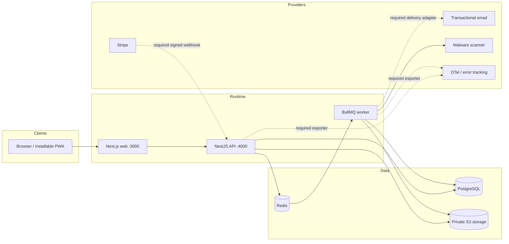
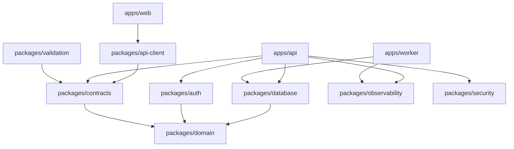

# Architecture

## Implementation status

The diagrams describe the implemented modular-monolith topology. Connected vertical slices include identity/session/account lifecycle/MFA, patient onboarding/intake, public discovery, tenant-scoped cases and collaboration, clinic operations, matching/concierge, verification, private-file lifecycle/scanning, treatment journey and bilingual Dental Passport, booking/Stripe deposits/refunds/invoices/webhooks, incidents/reviews/privacy intake, notifications, administration, health, audit, and outbox foundations. Provider certification and a bounded set of persistence-heavy worker processors remain deployment work; see [Known limitations](KNOWN_LIMITATIONS.md).

## Architectural style

DENTAL TRUST is a pnpm/Turborepo modular monorepo. The API is a NestJS modular monolith whose domain and application boundaries can be extracted later without distributed-system overhead today. PostgreSQL is the system of record; Redis and BullMQ execute asynchronous work; S3-compatible storage holds private documents.

## Dependency direction

Application dependencies point inward. Framework and provider code may depend on domain contracts; domain code does not import HTTP, ORM, UI, queue, or provider SDKs.

Cycles between feature modules are prohibited. Cross-module changes use a published application contract or a domain/outbox event, not another module's tables.

## Request and asynchronous boundaries

1. The web application obtains identity through secure, `HttpOnly`, same-site cookies and calls implemented endpoints through server-side route handlers. A typed client package exists but is not yet the sole web transport.
2. The API validates transport data, authenticates, resolves tenant/resource scope, invokes an application use case, commits the transaction, and serializes a stable contract.
3. Critical side effects are recorded in an outbox in the same transaction as domain changes.
4. The worker claims outbox/queue work with leases and bounded retry/dead-letter policy. File scanning, in-app notifications, localized SMTP email, optional authenticated HTTPS SMS/messaging delivery, verification expiry, and idempotent appointment/aftercare/failed-payment reminders are connected. Verification/reset secrets remain encrypted until the delivery worker constructs an expiring action URL in memory. Privacy export/deletion and provider bounce processors are tracked separately.
5. Logs carry request and W3C trace context across HTTP boundaries. API request/error counters, duration summaries, and BullMQ outcome/duration metrics are exposed in Prometheus text format. Optional OTLP JSON and error-reporting adapters fail without affecting the user request. Sensitive values are never sent in trace attributes or error payloads.

## Module boundaries

The schema and domain model group Identity/Access, Organizations, Verification, Directory, Patient Profiles, Cases/Matching, Plans, Scheduling, Payments, Messaging, Journey/Passport, Aftercare, Incidents/Warranties, Reviews, Files, Notifications, Content, Audit/Privacy, and Administration. Only the connected slices listed above currently have production HTTP workflows. Ownership is detailed in [DOMAIN_MODEL.md](DOMAIN_MODEL.md).

## Data and consistency

- ACID transactions currently protect implemented case/idempotency/audit/outbox, file-lifecycle, journey/passport/share, and payment/refund reconciliation work; schema constraints protect immutable plan acceptance, provider journey records, passport versions, and payment ledger identity. Application services for booking creation, verification, and several other workflows remain to be connected.
- Optimistic version columns or conditional updates reject stale state transitions.
- Provider event IDs, job deduplication keys, and idempotency keys have unique schema constraints. Stripe handlers preserve the raw signed body, store an allowlisted event summary, and apply monotonic provider-evidence transitions.
- Read models may be cached only when their invalidation and tenant keying are explicit.
- Private object metadata and access policy live in PostgreSQL; object storage never decides user authorization.

## Availability and observability

- Liveness proves the process event loop is running; readiness additionally checks required dependencies without exposing secrets.
- Machine-readable logs include timestamp, level, service, version, environment, correlation ID, actor ID where safe, and error code.
- Structured logs, request IDs, W3C `traceparent` propagation, bounded HTTP/queue metrics, OTLP trace export, and a redacted error-reporting adapter are implemented. Infrastructure-level database saturation and provider-account telemetry must still be supplied by the approved managed services.
- Shutdown stops accepting traffic, drains in-flight requests/jobs within a deadline, and closes database/Redis connections.

## Deployment topology

Web, API, and worker are independently deployable containers built from one immutable commit. A release applies backward-compatible migrations before shifting traffic, verifies readiness and core smoke tests, then retires the prior revision. Database rollback normally uses a forward-fix; destructive schema rollback requires a tested restore point and incident approval.

See [DEPLOYMENT.md](DEPLOYMENT.md) and [OPERATIONS_RUNBOOK.md](OPERATIONS_RUNBOOK.md).
