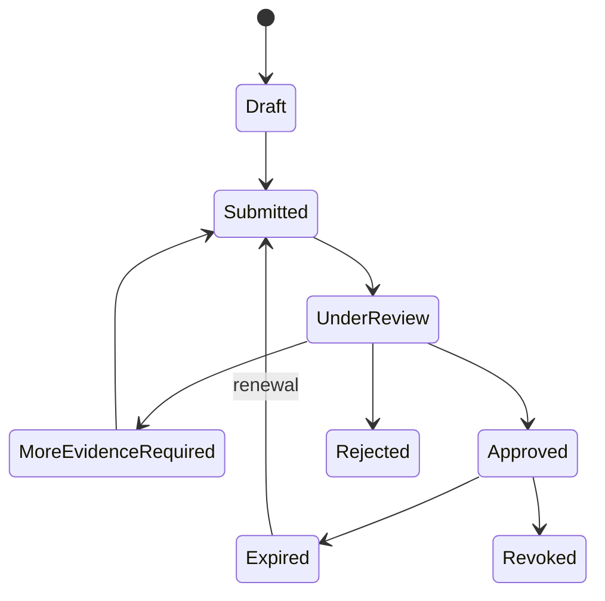
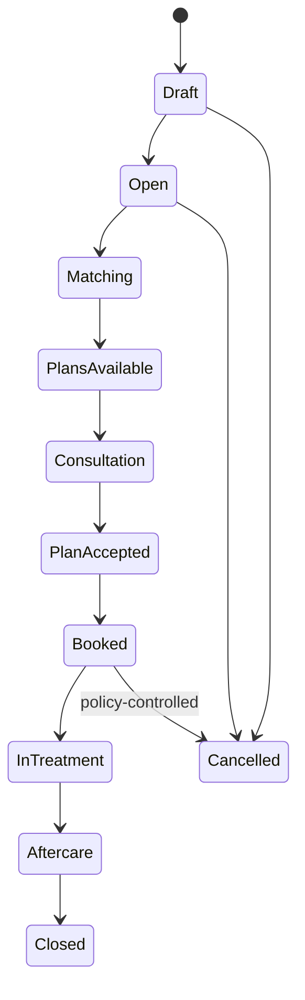
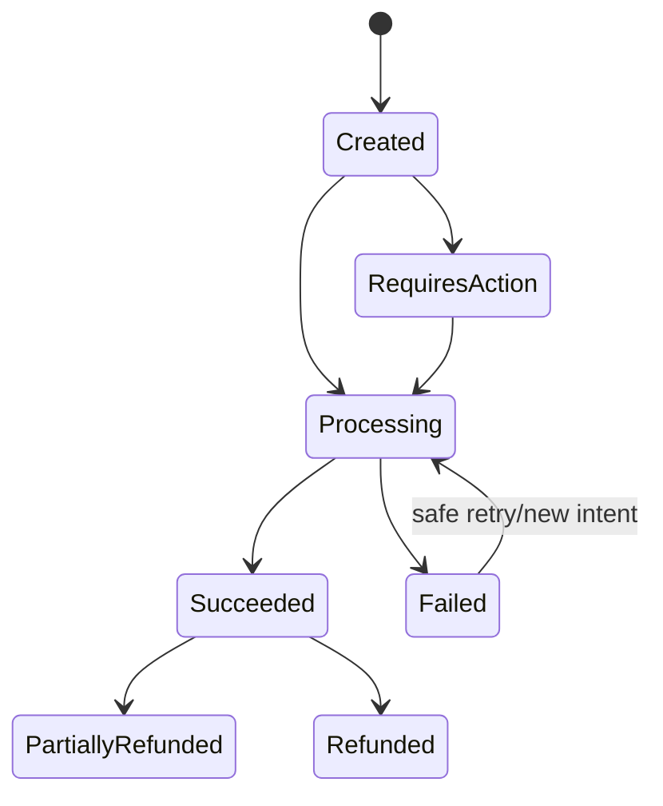
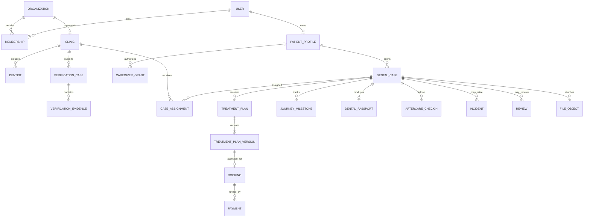

# Domain model

## Bounded contexts

| Context                | Owns                                                                 | Important invariants                                                                                                        |
| ---------------------- | -------------------------------------------------------------------- | --------------------------------------------------------------------------------------------------------------------------- |
| Identity & access      | users, credentials, sessions, email verification, memberships, roles | Disabled/unverified identities cannot obtain privileged sessions; access always includes resource scope.                    |
| Verification           | evidence, reviews, decisions, expiry, badges                         | Only approved, current, unrevoked evidence contributes to public verification. Reviewer and applicant duties are separated. |
| Directory              | clinics, locations, dentists, services, public profiles              | Published claims derive from approved data; paid placement cannot alter verification.                                       |
| Patient                | patient profile, consent, caregiver grants                           | A caregiver sees only explicitly granted scopes while the grant is active.                                                  |
| Cases & matching       | cases, assignments, matching rationale, tasks                        | Clinic access requires an active assignment; patient/authorized caregiver ownership remains authoritative.                  |
| Treatment plans        | plan submissions, immutable versions, comparisons, acknowledgements  | Accepted versions cannot be edited; material change creates a new version and acknowledgement.                              |
| Scheduling & booking   | availability, consultation, appointment, booking                     | Slots cannot be double-booked; booking references one accepted plan version.                                                |
| Payments               | payment intent, deposit, refund, ledger event                        | Provider callbacks are verified/idempotent; money states follow provider evidence, never client claims.                     |
| Journey & Passport     | milestones, clinical records, passport snapshots                     | Passport output has provenance and does not rewrite the original clinic record.                                             |
| Aftercare              | schedules, check-ins, escalation tasks                               | Concerning answers create an assigned escalation without automated diagnosis.                                               |
| Incidents & warranties | incident, evidence, responsibility, resolution                       | Status history is append-only and visible to authorized parties.                                                            |
| Reviews                | review eligibility, review, clinic response, moderation              | Only completed, attributable journeys are eligible; moderation never changes rating content silently.                       |
| Files                  | object metadata, quarantine, scan result, access grant               | Files are private and quarantined until validated and scanned.                                                              |
| Notifications          | preferences, templates, outbox, delivery attempts                    | Preferences and mandatory transactional categories are distinct; delivery is retry-safe.                                    |
| Audit & privacy        | audit events, export/erasure requests, support elevation             | Audit history is append-only; sensitive support access is visible, time-limited, and attributable.                          |

## Core state machines

All transitions are implemented through use cases that authorize the actor, validate the current version, persist the state change, append an audit event, and enqueue required side effects in one transaction.

## Entity relationship overview

The physical schema is documented in [DATABASE.md](DATABASE.md). Transport representations are versioned separately from domain entities and must not expose private persistence fields.
