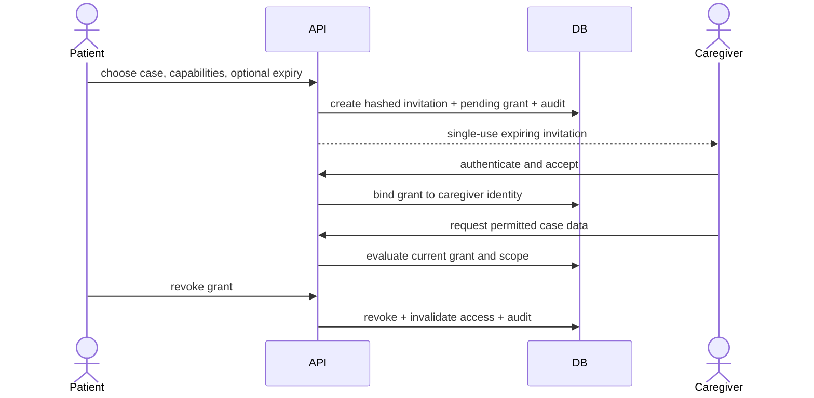

# Privacy architecture

## Principles

DENTAL TRUST uses purpose limitation, data minimization, explicit authorization, least privilege, retention by record category, and privacy-by-default. Regulatory obligations depend on the production jurisdictions and contracts; the system does not label itself compliant without a completed legal assessment.

## Data classification

| Class                        | Examples                                                                                       | Handling                                                                                                      |
| ---------------------------- | ---------------------------------------------------------------------------------------------- | ------------------------------------------------------------------------------------------------------------- |
| Restricted clinical/identity | scans, radiographs, treatment records, passport, government/license evidence, sensitive intake | Field/object encryption, strict case/verification scope, private storage, access audit, no analytics payloads |
| Confidential business        | treatment quotations, contracts, incident/warranty evidence, internal verification notes       | Tenant/action scope, encryption at rest, audited exports                                                      |
| Internal operational         | assignment metadata, delivery status, non-sensitive audit metadata                             | Staff capability scope, bounded retention                                                                     |
| Public approved              | published clinic/dentist/service profiles, methodology, moderated reviews                      | Publication workflow and provenance; no private source evidence                                               |

## Consent and caregiver flow

Consent records preserve the notice/version, scope, actor, timestamp, evidence, and withdrawal. Consent is not used as a blanket substitute for another lawful basis or contractual requirement.

## Privacy request flow

1. Authenticate the requester with appropriate assurance and verify authority.
2. Record request type, jurisdiction, scope, deadline, and case owner without placing sensitive details in task titles/logs.
3. Discover data across PostgreSQL, private object storage, provider metadata, and approved backups/retention exceptions.
4. Review third-party and legal-hold constraints; use dual control for broad exports.
5. Generate a machine-readable, private, short-lived export or perform approved erasure/anonymization.
6. Record exactly what was included, removed, retained and why; expire generated export objects.

The API and worker implement authenticated export/deletion intake, owner-scoped status/download reads, an MFA-protected administrative queue, optimistic transitions, encrypted requester/admin text, structured identity-verification evidence, scoped legal holds, and durable execution. Export archives use store-only ZIP streaming, deterministic JSON, per-source checksum/size verification, private server-side-encrypted object storage, a bounded archive size, short expiry, fresh signed downloads, and an hourly purge. Deletion requires a delivered minimal-disclosure warning, checks active professional membership, care, financial activity, incidents, and legal holds, revokes sessions/tokens/MFA/caregiver grants/shares, then records a category-level deidentification or retained-hold outcome. Database triggers keep successful evidence and released holds append-oriented.

Automatic discovery is currently limited to Dental Trust PostgreSQL records and Dental Trust private object storage. Production provider/subprocessor discovery, jurisdiction-approved category dispositions, backup-tombstone propagation, and dual-control operating review remain release gates; a completed execution does not claim those external procedures occurred.

## Retention and deletion

No universal record-retention period is hardcoded. Export artifacts alone have a configured short TTL and automated purge. A production retention schedule must still cover identity, intake, case/clinical coordination, verification evidence, payments, messages, files, incidents/warranties, reviews, audit/security events, notifications, and backups. Legal holds override destructive handling. Backup expiry is documented; restores must reapply tombstones/erasure ledgers before serving traffic.

## Cross-border and providers

Before production, identify controller/processor roles, hosting region, clinic data-sharing terms, subprocessors, transfer mechanism, breach duties, data residency, and patient notices for Vietnam and target overseas markets. Only the minimum provider payload is sent; medical content is excluded from email/SMS/error telemetry unless explicitly approved and secured.

## Analytics

Product analytics use pseudonymous identifiers and allow-listed events. Free-form medical text, filenames, email addresses, phone numbers, signed URLs, payment secrets, and verification source documents are prohibited event properties. Operational dashboards use aggregated or permission-scoped data.
