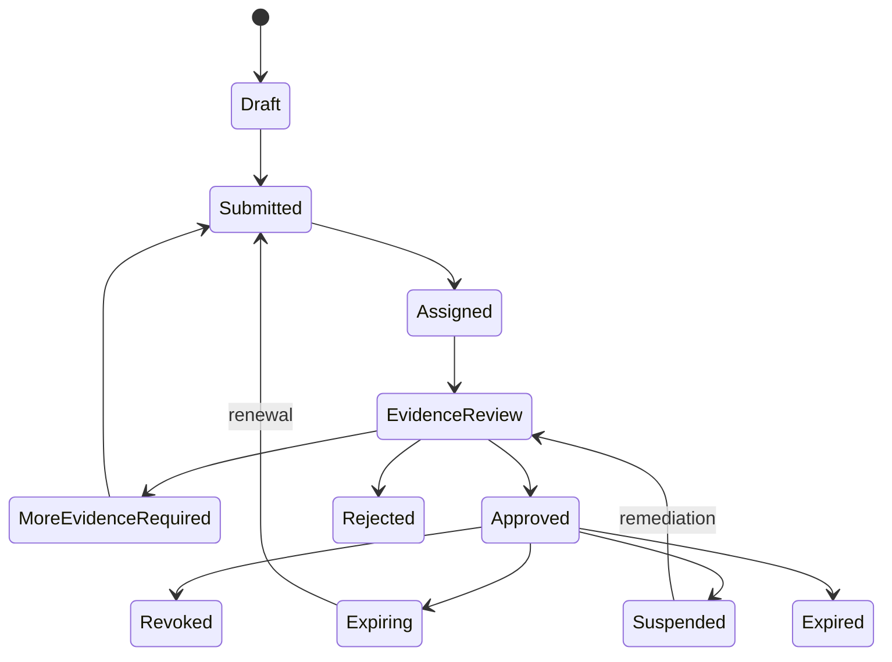
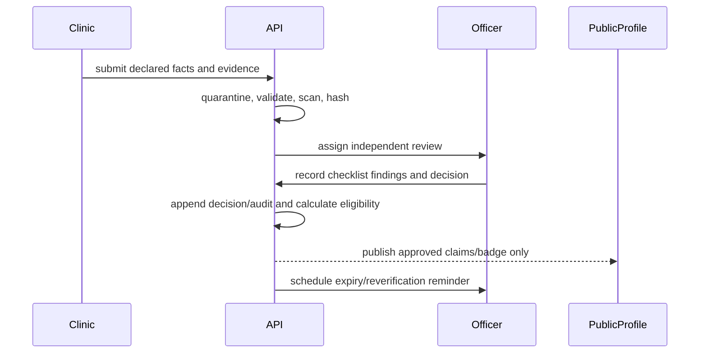

# Verification model

## Purpose

Verification communicates the evidence DENTAL TRUST reviewed at a point in time. It is not a guarantee of outcome, a clinical recommendation, or a paid ranking. Public wording must state the evidence category, decision date, expiry, and methodology version.

## Evidence categories

- Clinic legal registration and operating license.
- Dentist identity, current professional license, specialty credentials, and clinic affiliation.
- Facility address and declared equipment/capabilities with source provenance.
- Infection-control and safety evidence approved by the compliance policy.
- Professional liability/warranty documents where required.
- Service/pricing claims, inclusions, exclusions, and material limitations.
- Adverse decision, suspension, expiry, and remediation history that policy permits publishing.

Source files remain private. Public profiles expose approved conclusions and safe provenance, never government IDs or raw sensitive documents.

## Workflow

## Decision controls

- Separation of submitter and decision maker; conflicts of interest are declared.
- Mandatory checklist items and rationale for each decision.
- Evidence issuer, document/reference number where safe, issue/expiry dates, received timestamp, content hash, reviewer, and methodology version.
- Four-eyes approval for exceptions, reinstatement after serious suspension, and methodology override.
- Immutable decision history; corrections append a superseding decision.
- Automatic expiry removes the badge unless a policy-approved grace state is explicitly displayed.
- Advertising/payment data is unavailable to the eligibility policy and verification reviewer.

## Public status semantics

`Verified` means all mandatory checks are approved and current. `Verification in progress` must not visually resemble verified. `Expired`, `suspended`, `revoked`, `rejected`, and `not verified` are distinct internal states; public wording follows the approved disclosure policy without implying unreviewed wrongdoing.

## Review and appeal

Clinics may submit additional evidence or appeal a decision. The appeal is assigned to a different authorized reviewer where practical, preserves the original record, and never silently republishes the badge. Complaints and credible new evidence can trigger suspension and expedited review.
